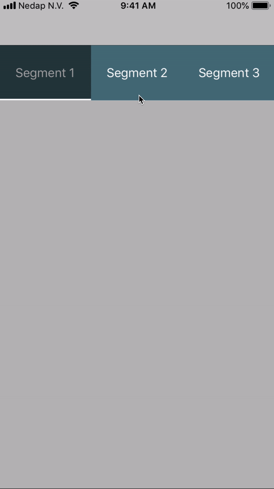

# Segnify

[](https://img.shields.io/badge/swift-4.2-brightgreen.svg)
[](https://img.shields.io/cocoapods/v/Segnify.svg)
[](https://github.com/nedap/Segnify)
[](https://img.shields.io/cocoapods/p/Segnify.svg)

An elegant, performing and fancy segmented component in Swift.



## Features

- [x] Textual segments: `TextSegment`
- [x] Image segments: `ImageSegment`
- [x] Segment selection indicator: `Segnicator`
- [x] Modular components, based on `UIButton`, `UIPageViewController`, `UIScrollView` and `UIStackView`
- [x] Fully customizable with extensive usage of different, independent protocols
- [x] Size & positioning based on Auto Layout
- [x] 100% code, 0% Storyboard / XIB

## Requirements

- iOS 9.3+
- Xcode 9.3+
- Swift 4.2+

## Installation

### CocoaPods

[CocoaPods](https://cocoapods.org) is a dependency manager for Cocoa projects. You can install it with the following command:

```bash
$ gem install cocoapods
```

To integrate Segnify into your Xcode project using CocoaPods, specify it in your `Podfile`:

```ruby
platform :ios, '9.3'
use_frameworks!

target '<Your Target Name>' do
    pod 'Segnify'
end
```

Then, run the following command:

```bash
$ pod install
```

### Carthage

[Carthage](https://github.com/Carthage/Carthage) is a decentralized dependency manager that builds your dependencies and provides you with binary frameworks.

You can install Carthage with [Homebrew](https://brew.sh/) using the following command:

```bash
$ brew update
$ brew install carthage
```

To integrate Segnify into your Xcode project using Carthage, specify it in your `Cartfile`:

```ogdl
github "nedap/Segnify" ~> 1.1.0
```

Run `carthage update` to build the framework and drag the built `Segnify.framework` into your Xcode project.

## Usage

### General

- Usage of `Segnify` starts with an instance of `PageViewController`. `PageViewController` is the main class and represents a view controller, which contains an instance of `Segnify` and an instance of `UIPageViewController`. 

- The `Segnify` instance represents the different `Segment` instances which can independently be selected by the user. Selecting a `Segment` instance will trigger the `UIPageViewController` instance, which will in turn show the corresponding content. When the user swipes the content shown by the `UIPageViewController` instance to the left or right, the `Segnify` instance will react accordingly as well.

- A `Segnicator` instance represents a transparant view on top of the `Segnify` instance and can be used for visually indicating the currently selected `Segment` instance. 'Segnicator' is based on 'indicator', hence its name and function. The `Segnicator` instance will always be on top of the currently selected `Segment` instance. By adding one or more subviews of your liking to the `Segnicator` instance and adding Auto Layout constraints accordingly, the visual indicator can be fully customized.

### Default

The various protocols are by default implemented by [DefaultDelegates](https://github.com/nedap/Segnify/blob/master/Segnify/Protocols/Default/DefaultDelegates.swift). The simplest way to make use of `Segnify` is:

``` swift
import Segnify

public class MainViewController: PageViewController {}
```

By purely subclassing it and not changing anything, or by initializing a new `PageViewController` instance and adding it as a child view controller, default implementations will be chosen and three `TextSegment` instances will be added, together with three randomly generated `UIViewController` instances.

### Customized example

Next to the `Segnify` framework target, there is a `Segnified` app target in the project file. By running the `Segnified` scheme, an example application will be run which represents a showcase of all customization possibilities of `Segnify`.

The `MainViewController` of the example app looks like this:

``` swift
import Segnify

public class MainViewController: PageViewController {
    
    // MARK: - Private delegates
    
    private lazy var imageSegmentDelegate = ImageSegmentDelegate()
    
    private lazy var pageViewControllerDelegate = PageViewControllerDelegate()
    
    private lazy var segnicatorDelegate = SegnicatorDelegate()
    
    private lazy var segnifyDelegate = SegnifyDelegate()
    
    private lazy var textSegmentDelegate = TextSegmentDelegate()
    
    // MARK: - View lifecycle
    
    public override func viewDidLoad() {
        super.viewDidLoad()
        
        dataSource = self
        delegate = pageViewControllerDelegate
        
        segnify.delegate = segnifyDelegate
        segnify.segnicator = Segnicator(configuration: segnicatorDelegate)
    }
}

// MARK: - SegnifyDataSourceProtocol

extension MainViewController: SegnifyDataSourceProtocol {
    
    public var contentElements: [SegnifyContentElement] {
        return [
            (segment: ImageSegment(image: UIImage(named: "demo_number_1_icon"), configuration: imageSegmentDelegate),
             viewController: LabeledViewController(text: "Hey you! This is number 1.")),
            (segment: TextSegment(text: "Number 2", configuration: textSegmentDelegate),
             viewController: LabeledViewController(text: "This is number 2 indeed.")),
            (segment: ImageSegment(image: UIImage(named: "demo_number_3_icon"), configuration: imageSegmentDelegate),
             viewController: LabeledViewController(text: "Ola! Si si, 3 it is.")),
            (segment: TextSegment(text: "Numéro 4", configuration: textSegmentDelegate),
             viewController: LabeledViewController(text: "Oh man, number 4 already.")),
            (segment: TextSegment(text: "5 💁🏼‍♂️", configuration: textSegmentDelegate),
             viewController: LabeledViewController(text: "Number 5 is being shown."))
        ]
    }
}
```

Take a look at the [Segnified](https://github.com/nedap/Segnify/blob/master/Segnified) folder for all the details.

### Protocols

For customization purposes, which you'd likely need, implement one or more of the following protocols.

#### ImageSegmentProtocol

Implement `ImageSegmentProtocol` for customizing image segments. In the example below, the default implemention in [DefaultDelegates](https://github.com/nedap/Segnify/blob/master/Segnify/Protocols/Default/DefaultDelegates.swift) is being shown.

```swift
extension DefaultDelegates: ImageSegmentProtocol {
    
    public func adjustsImage(for state: UIControl.State) -> Bool {
        return false
    }
    
    public func segmentBackgroundColor(for state: UIControl.State) -> UIColor {
        switch state {
        case .highlighted, .selected,  [.selected, .highlighted]:
            return UIColor(red: 39.0/255.0, green: 59.0/255.0, blue: 66.0/255.0, alpha: 1.0)
        default:
            return .clear
        }
    }
}
```

#### PageViewControllerDataSourceProtocol

Implement `PageViewControllerDataSourceProtocol` for defining the data source of the `UIPageViewController` instance. In the example below, the default implemention in [DefaultDelegates](https://github.com/nedap/Segnify/blob/master/Segnify/Protocols/Default/DefaultDelegates.swift) is being shown.

```swift
extension DefaultDelegates: PageViewControllerDataSourceProtocol {
    
    public var viewControllers: [UIViewController] {
        if randomViewControllers.isEmpty {
            // Fill the collection of random view controllers.
            randomViewControllers = [generateViewController(),
                                     generateViewController(),
                                     generateViewController()]
        }
        
        return randomViewControllers
    }
}
```

#### PageViewControllerProtocol

Implement `PageViewControllerProtocol` for visually customizing the `PageViewController` instance. In the example below, the default implemention in [DefaultDelegates](https://github.com/nedap/Segnify/blob/master/Segnify/Protocols/Default/DefaultDelegates.swift) is being shown.

```swift
extension DefaultDelegates: PageViewControllerProtocol {
    
    public var segnifyHeight: CGFloat {
        return 75.0
    }
}
```

#### SegnicatorProtocol

Implement `SegnicatorProtocol` for visually customizing the `Segnicator` instance. In the example below, the default implemention in [DefaultDelegates](https://github.com/nedap/Segnify/blob/master/Segnify/Protocols/Default/DefaultDelegates.swift) is being shown.

A white, horizontal line is created and added as a subview. Auto Layout constraints have been applied using the `SegnifyLayoutConstraint` extension. By using the `SegnicatorSubviewsClosure` typealias, subviews and Auto Layout constraints can easily be added, as it takes a reference to a `Segnicator` instance as a parameter.

```swift
extension DefaultDelegates: SegnicatorProtocol {
    
    public var segnicatorSubviewsClosure: SegnicatorSubviewsClosure? {
        return { segnicator in
            // Create a white, horizontal indicator view.
            let whiteIndicatorView = UIView()
            whiteIndicatorView.backgroundColor = .white
            
            // Add it to the segnicator and give it the correct layout.
            segnicator.addSubview(whiteIndicatorView)
            NSLayoutConstraint.activate([
                whiteIndicatorView.leadingAnchor.constraint(equalTo: segnicator.leadingAnchor),
                whiteIndicatorView.trailingAnchor.constraint(equalTo: segnicator.trailingAnchor),
                whiteIndicatorView.bottomAnchor.constraint(equalTo: segnicator.bottomAnchor),
                whiteIndicatorView.heightAnchor.constraint(equalToConstant: 2.0)
                ], for: whiteIndicatorView)
        }
    }
}
```

#### SegnifyDataSourceProtocol

Implement `SegnifyDataSourceProtocol` for defining the data source of the `Segnify` instance. In the example below, the default implemention in [DefaultDelegates](https://github.com/nedap/Segnify/blob/master/Segnify/Protocols/Default/DefaultDelegates.swift) is being shown.

```swift
extension DefaultDelegates: SegnifyDataSourceProtocol {
    
    public var segments: [Segment] {
        if randomSegments.isEmpty {
            // Fill the collection of segments.
            randomSegments = [TextSegment(text: "Segment 1", configuration: self),
                              TextSegment(text: "Segment 2", configuration: self),
                              TextSegment(text: "Segment 3", configuration: self)]
        }
        
        return randomSegments
    }
}
```

#### SegnifyProtocol

Implement `SegnifyProtocol` for visually customizing the `Segnify` instance. In the example below, the default implemention in [DefaultDelegates](https://github.com/nedap/Segnify/blob/master/Segnify/Protocols/Default/DefaultDelegates.swift) is being shown.

```swift
extension DefaultDelegates: SegnifyProtocol {
    
    public var equallyFillHorizontalSpace: Bool {
        return true
    }
    
    public var isBouncingHorizontally: Bool {
        return true
    }
    
    public var segmentWidth: CGFloat {
        return 150.0
    }
    
    public var segnifyBackgroundColor: UIColor {
        return UIColor(red: 76.0/255.0, green: 114.0/255.0, blue: 128.0/255.0, alpha: 1.0)
    }
}
```

#### TextSegment

Implement `TextSegmentProtocol` for customizing textual segments. In the example below, the default implemention in [DefaultDelegates](https://github.com/nedap/Segnify/blob/master/Segnify/Protocols/Default/DefaultDelegates.swift) is being shown.

```swift
extension DefaultDelegates: TextSegmentProtocol {
    
    public var font: UIFont {
        return UIFont.systemFont(ofSize: 17.0)
    }
    
    public func textColor(for state: UIControl.State) -> UIColor {
        switch state {
        case .highlighted, .selected:
            return .lightGray
        default:
            return .white
        }
    }
}
```
Note that `segmentBackgroundColor(for:)` is already implemented for `ImageSegmentProtocol`.

## License

Copyright © 2018 N.V. Nederlandsche Apparatenfabriek (Nedap). All rights reserved.

See the [LICENSE](LICENSE) file for more info.

## Changelog

See the [CHANGELOG](CHANGELOG.md) file.


