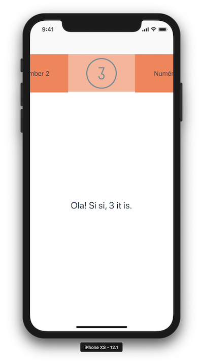
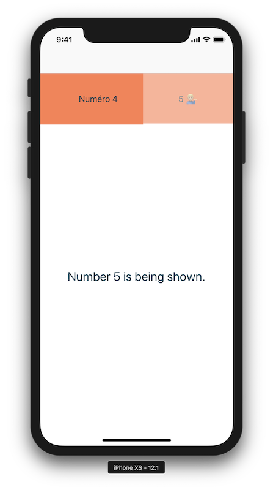

# Segnify for iOS

[](https://img.shields.io/badge/swift-4.2-brightgreen.svg)
[](https://img.shields.io/cocoapods/v/Segnify.svg)
[](https://github.com/nedap/segnify-ios)
[](https://img.shields.io/cocoapods/p/Segnify.svg)

An elegant, performing and fancy segmented component in Swift.

 

## Features

- [x] Textual segments: `TextSegment`
- [x] Image segments: `ImageSegment`
- [x] Segment selection indicator: `Segnicator`
- [x] Modular components, based on `UIButton`, `UIPageViewController`, `UIScrollView` and `UIStackView`
- [x] Support for infinite scrolling
- [x] Fully customizable with extensive usage of different, independent protocols
- [x] Size & positioning based on Auto Layout
- [x] 100% code, 0% Storyboard / XIB

## Requirements

- iOS 9.3+
- Xcode 9.3+
- Swift 4.2+

## Installation

### CocoaPods

[CocoaPods](https://cocoapods.org) is a dependency manager for Cocoa projects. You can install it with the following command:

```bash
$ gem install cocoapods
```

To integrate Segnify into your Xcode project using CocoaPods, specify it in your `Podfile`:

```ruby
platform :ios, '9.3'
use_frameworks!

target '<Your Target Name>' do
    pod 'Segnify'
end
```

Then, run the following command:

```bash
$ pod install
```

### Carthage

[Carthage](https://github.com/Carthage/Carthage) is a decentralized dependency manager that builds your dependencies and provides you with binary frameworks.

You can install Carthage with [Homebrew](https://brew.sh/) using the following command:

```bash
$ brew update
$ brew install carthage
```

To integrate Segnify into your Xcode project using Carthage, specify it in your `Cartfile`:

```ogdl
github "nedap/segnify-ios" ~> 1.1.1
```

Run `carthage bootstrap` to build the framework and drag the built `Segnify.framework` into your Xcode project.

## Usage

### General

- Usage of `Segnify` starts with an instance of `PageViewController`. `PageViewController` is the main class and represents a view controller, which contains an instance of `Segnify` and an instance of `UIPageViewController`. 

- The `Segnify` instance represents the different `Segment` instances which can independently be selected by the user. Selecting a `Segment` instance will trigger the `UIPageViewController` instance, which will in turn show the corresponding content. When the user swipes the content shown by the `UIPageViewController` instance to the left or right, the `Segnify` instance will react accordingly as well.

- A `Segnicator` instance represents a transparant view on top of the `Segnify` instance and can be used for visually indicating the currently selected `Segment` instance. 'Segnicator' is based on 'indicator', hence its name and function. The `Segnicator` instance will always be on top of the currently selected `Segment` instance. By adding one or more subviews of your liking to the `Segnicator` instance and adding Auto Layout constraints accordingly, the visual indicator can be fully customized.

### Defaults

The various protocols are by default implemented by some default delegates, found in the [Defaults](Segnify/Protocols/Defaults) folder. The following delegates are being used:

- [DefaultImageSegmentDelegate](Segnify/Protocols/Defaults/DefaultImageSegmentDelegate.swift)
- [DefaultPageViewControllerDelegate](Segnify/Protocols/Defaults/DefaultPageViewControllerDelegate.swift)
- [DefaultSegnicatorDelegate](Segnify/Protocols/Defaults/DefaultSegnicatorDelegate.swift)
- [DefaultSegnifyDataSourceDelegate](Segnify/Protocols/Defaults/DefaultSegnifyDataSourceDelegate.swift)
- [DefaultSegnifyDelegate](Segnify/Protocols/Defaults/DefaultSegnifyDelegate.swift)
- [DefaultTextSegmentDelegate](Segnify/Protocols/Defaults/DefaultTextSegmentDelegate.swift)

The simplest way to make use of `Segnify` is:

``` swift
import Segnify

public class MainViewController: PageViewController {}
```

By purely subclassing it and not changing anything, or by initializing a new `PageViewController` instance and adding it as a child view controller, default implementations will be chosen and three `TextSegment` instances will be added, together with three randomly generated `UIViewController` instances.

### Customized example

Next to the `Segnify` framework target, there is a `Segnified` app target in the project file. By running the `Segnified` scheme, an example application will be run which represents a showcase of all customization possibilities of `Segnify`.

The `MainViewController` of the example app looks like this:

``` swift
import Segnify

public class MainViewController: PageViewController {
    
    // MARK: - Private delegates
    
    private var content = [SegnifyContentElement]()
    
    private lazy var imageSegmentDelegate = ImageSegmentDelegate()
    
    private lazy var pageViewControllerDelegate = PageViewControllerDelegate()
    
    private lazy var segnicatorDelegate = SegnicatorDelegate()
    
    private lazy var segnifyDelegate = SegnifyDelegate()
    
    private lazy var textSegmentDelegate = TextSegmentDelegate()
    
    // MARK: - Lifecycle
    
    public override init(nibName nibNameOrNil: String?, bundle nibBundleOrNil: Bundle?) {
        super.init(nibName: nibNameOrNil, bundle: nibBundleOrNil)
        setup()
    }
    
    public required init?(coder aDecoder: NSCoder) {
        super.init(coder: aDecoder)
        setup()
    }
    
    // MARK: - Setup
    
    private func setup() {
        // Customize.
        do {
            try setDataSource(self)
            
            delegate = pageViewControllerDelegate
            segnify.delegate = segnifyDelegate
            segnify.segnicator = Segnicator(configuration: segnicatorDelegate)
        }
        catch {
            // Fail.
            print("Failed to set the data source. Make sure it isn't nil.")
        }
    }
}

// MARK: - SegnifyDataSourceProtocol

extension MainViewController: SegnifyDataSourceProtocol {
    
    public var contentElements: [SegnifyContentElement] {
        if content.isEmpty {
            content = [
                (segment: ImageSegment(image: UIImage(named: "demo_number_1_icon"), configuration: imageSegmentDelegate),
                 viewController: PageViewContentViewController(text: "Hey you! This is number 1.")),
                (segment: TextSegment(text: "Number 2", configuration: textSegmentDelegate),
                 viewController: PageViewContentViewController(text: "This is number 2 indeed.")),
                (segment: ImageSegment(image: UIImage(named: "demo_number_3_icon"), configuration: imageSegmentDelegate),
                 viewController: PageViewContentViewController(text: "Ola! Si si, 3 it is.")),
                (segment: TextSegment(text: "Numéro 4", configuration: textSegmentDelegate),
                 viewController: PageViewContentViewController(text: "Oh man, number 4 already.")),
                (segment: TextSegment(text: "5 💁🏼‍♂️", configuration: textSegmentDelegate),
                 viewController: PageViewContentViewController(text: "Number 5 is being shown."))
            ]
        }
        
        return content
    }
}
```

Take a look at the [Segnified](https://github.com/nedap/segnify-ios/blob/master/Segnified) folder for all the details.

### Protocols

For customization purposes, which you'd likely need, implement one or more of the following protocols.

### ForwardedEventsProtocol

Implement `ForwardedEventsProtocol ` for the ability to be informed about several events, caused by either the `Segnify` instance or the `UIPageViewController` instance:

- Getting the view controller before the currently displayed one
- Getting the view controller after the currently displayed one
- Gesture-initiated transition triggers
- Segment selection trigger

The protocol partly relies on the `UIPageViewControllerDataSource` and `UIPageViewControllerDelegate` protocols. All protocol methods are optional.

#### ImageSegmentProtocol

Implement `ImageSegmentProtocol` for customizing image segments. In the example below, the default implementation in [DefaultImageSegmentDelegate](Segnify/Protocols/Defaults/DefaultImageSegmentDelegate.swift) is being shown.

```swift
public class DefaultImageSegmentDelegate: ImageSegmentProtocol {
    
    // MARK: - Delegate
    
    public func backgroundColor(for state: UIControl.State) -> UIColor {
        switch state {
        case .highlighted, .selected,  [.selected, .highlighted]:
            return .init(red: 39.0/255.0, green: 59.0/255.0, blue: 66.0/255.0, alpha: 1.0)
        default:
            return .clear
        }
    }
}
```

#### PageViewControllerProtocol

Implement `PageViewControllerProtocol` for visually customizing the `PageViewController` instance. In the example below, the default implementation in [DefaultPageViewControllerDelegate](Segnify/Protocols/Defaults/DefaultPageViewControllerDelegate.swift) is being shown.

```swift
public class DefaultPageViewControllerDelegate: PageViewControllerProtocol {
    
    // MARK: - Delegate
    
    public var backgroundColor: UIColor {
        return .black
    }
    
    public var segnifyHeight: CGFloat {
        return 75.0
    }
}
```

#### SegnicatorProtocol

Implement `SegnicatorProtocol` for visually customizing the `Segnicator` instance. In the example below, the default implementation in [DefaultSegnicatorDelegate](Segnify/Protocols/Defaults/DefaultSegnicatorDelegate.swift) is being shown.

A white, horizontal line is created and added as a subview. Auto Layout constraints have been applied using the `SegnifyLayoutConstraint` extension.

```swift
public class DefaultSegnicatorDelegate: SegnicatorProtocol {

    // MARK: - Delegate
    
    public var segnicatorView: UIView {
        // Create a white, half-transparent background view.
        let backgroundView = UIView()
        backgroundView.backgroundColor = .clear
        
        // Create a white, horizontal indicator view.
        let whiteIndicatorView = UIView()
        whiteIndicatorView.backgroundColor = .white
        
        // Add it to the segnicator and give it the correct layout.
        backgroundView.addSubview(whiteIndicatorView)
        NSLayoutConstraint.activate([
            whiteIndicatorView.leadingAnchor.constraint(equalTo: backgroundView.leadingAnchor),
            whiteIndicatorView.bottomAnchor.constraint(equalTo: backgroundView.bottomAnchor),
            whiteIndicatorView.trailingAnchor.constraint(equalTo: backgroundView.trailingAnchor),
            whiteIndicatorView.heightAnchor.constraint(equalToConstant: 2.0)
            ], for: whiteIndicatorView)
        
        return backgroundView
    }
}
```

#### SegnifyDataSourceProtocol

Implement `SegnifyDataSourceProtocol` for defining the data source of the `Segnify` instance and the `UIPageViewController` instance. One or more `SegnifyContentElement` elements should be used, which is a tuple, representing a `Segment` instance and a `UIViewController` instance.

In the example below, the default implementation in [DefaultSegnifyDataSourceDelegate](Segnify/Protocols/Defaults/DefaultSegnifyDataSourceDelegate.swift) is being shown.

```swift
public class DefaultSegnifyDataSourceDelegate: SegnifyDataSourceProtocol {
    
    // MARK: - Private
    
    /// Define an instance of `DefaultTextSegmentDelegate`.
    private lazy var textSegmentDelegate: TextSegmentProtocol = {
        return DefaultTextSegmentDelegate()
    }()
    
    /// Generate a new UIViewController instance with a random background color.
    private func generateViewController() -> UIViewController {
        let viewController = UIViewController()
        viewController.view.backgroundColor = UIColor(white: .random(in: 0.0 ... 1.0), alpha: 1.0)
        return viewController
    }
    
    /// The collection of segment-viewcontroller-tuples, used by the `Segnify` instance.
    private lazy var content: [SegnifyContentElement] = {
        return [(segment: TextSegment(text: "Segment 1", configuration: textSegmentDelegate),
                 viewController: generateViewController()),
                (segment: TextSegment(text: "Segment 2", configuration: textSegmentDelegate),
                 viewController: generateViewController()),
                (segment: TextSegment(text: "Segment 3", configuration: textSegmentDelegate),
                 viewController: generateViewController())]
    }()
    
    // MARK: - Delegate
    
    public var contentElements: [SegnifyContentElement] {
        return content
    }
}
```

#### SegnifyProtocol

Implement `SegnifyProtocol` for visually customizing the `Segnify` instance. In the example below, the default implementation in [DefaultSegnifyDelegate](Segnify/Protocols/Defaults/DefaultSegnifyDelegate.swift) is being shown.

```swift
public class DefaultSegnifyDelegate: SegnifyProtocol {

    // MARK: - Delegate
    
    public var backgroundColor: UIColor {
        return .init(red: 76.0/255.0, green: 114.0/255.0, blue: 128.0/255.0, alpha: 1.0)
    }
    
    public var isEquallyFillingHorizontalSpace: Bool {
        return true
    }
    
    public var segmentWidth: CGFloat {
        return 150.0
    }
}
```

#### TextSegment

Implement `TextSegmentProtocol` for customizing textual segments. In the example below, the default implementation in [DefaultTextSegmentDelegate](Segnify/Protocols/Defaults/DefaultTextSegmentDelegate.swift) is being shown.

```swift
public class DefaultTextSegmentDelegate: TextSegmentProtocol {
    
    // MARK: - Delegate
    
    public func backgroundColor(for state: UIControl.State) -> UIColor {
        switch state {
        case .highlighted, .selected,  [.selected, .highlighted]:
            return .init(red: 39.0/255.0, green: 59.0/255.0, blue: 66.0/255.0, alpha: 1.0)
        default:
            return .clear
        }
    }
    
    public var font: UIFont {
        return .systemFont(ofSize: 17.0)
    }
    
    public func textColor(for state: UIControl.State) -> UIColor {
        switch state {
        case .highlighted, .selected:
            return .lightGray
        default:
            return .white
        }
    }
}
```

## License

Copyright © 2020 Nederlandsche Apparatenfabriek (Nedap) N.V.. All rights reserved.

See the [LICENSE](LICENSE) file for more info.

## Changelog

See the [CHANGELOG](CHANGELOG.md) file.


